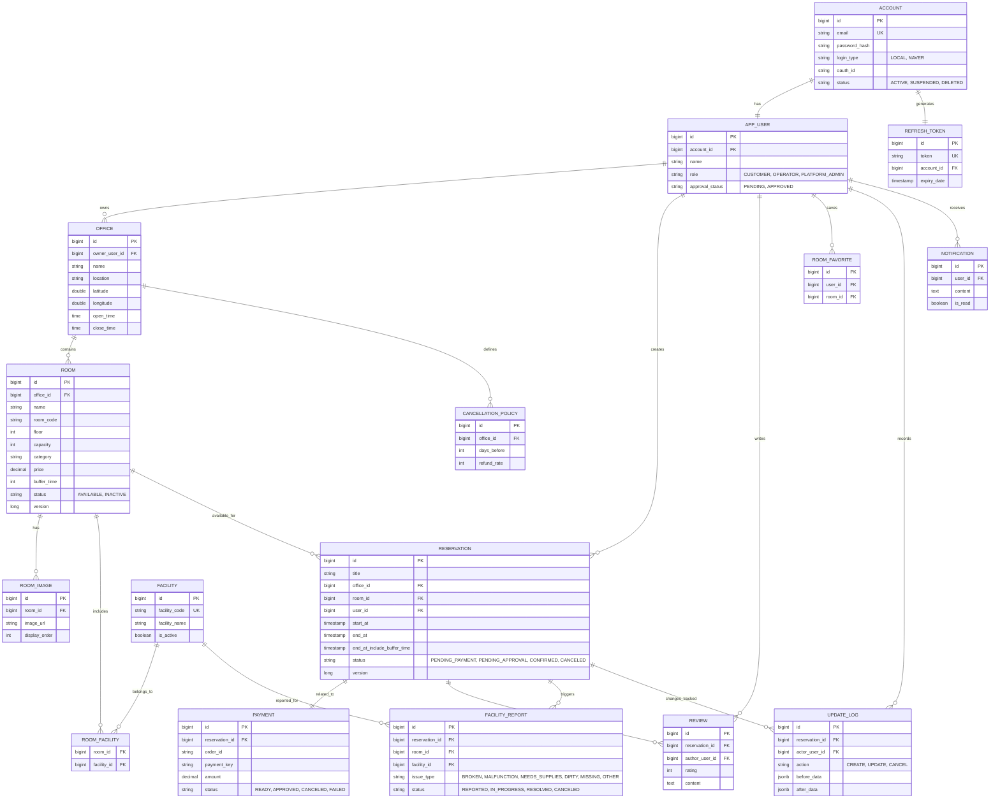

# 모두의 오피스 (Modu_office)

**Modu_office**는 회의실과 공용 공간을 예약하고 관리하는 **웹 기반 예약 및 운영 관리 시스템**입니다.
동시성 제어, 실시간 알림, 결제 연동, 운영 대시보드를 갖춘 완전한 예약 서비스입니다.

---

## 🚀 Live Demo
- [**Modu Office 서비스 바로가기**](http://3.107.105.35)

---

## 주요 기능 (Features)

### 사용자 (User)

- **회의실 검색 및 예약**: QueryDSL 기반 다중 조건 필터링(위치, 인원, 편의 시설, 가격)과 Google Maps API 연동 반경 검색으로 회의실을 탐색하고 예약합니다.
- **유사 회의실 추천**: 거리(Haversine), 시설 유사도, 과거 예약 통계를 결합한 가중치 기반 대안 회의실을 추천합니다.
- **실시간 예약 현황**: SSE(Server-Sent Events)로 다른 사용자의 예약/취소를 새로고침 없이 즉시 반영합니다.
- **결제 및 환불**: 토스페이먼츠 결제 위젯 연동과 지점별 취소 정책에 따른 차등 환불을 제공합니다.
- **Naver OAuth 로그인**: 네이버 소셜 로그인을 통한 간편 회원가입 및 인증을 지원합니다.
- **후기 및 즐겨찾기**: 이용 완료된 예약에 대한 후기 작성과 회의실 즐겨찾기 기능을 제공합니다.

### 운영자 (Manager)

- **공간 관리**: 담당 지점의 회의실 정보, 가격, 장비, 이미지를 관리합니다.
- **예약 Buffer Time 설정**: 회의실별 정비 시간을 설정하여 예약 간 자동으로 여유 시간을 확보합니다.
- **운영 대시보드**: 점유율, 취소율, 인기 회의실, 피크타임 등 통계를 조회합니다.
- **시설 신고 관리**: 고객의 시설 고장 신고를 접수하고 처리 상태를 추적합니다.

### 관리자 (Admin)

- **사용자 관리**: 회원 조회, 운영자 승인, 계정 정지/복구를 처리합니다.
- **감사 로그**: PostgreSQL JSONB 기반 Before/After 스냅샷으로 예약 변경 이력을 추적합니다.
- **예약 강제 취소**: 사유 기록과 함께 관리자 권한으로 예약을 강제 취소합니다.

---

## 기술 하이라이트

| 해결한 문제                  | 적용 기술                                                  |
| ---------------------------- | ---------------------------------------------------------- |
| 동시 예약 요청 시 중복 발생  | JPA `@Version` 낙관적 락 + DB 레벨 이중 검증               |
| 예약 현황의 실시간 동기화    | SSE 기반 이벤트 스트리밍 (WebSocket에서 전환)              |
| 예약 검증 규칙의 산발적 분산 | 전략 패턴(Strategy Pattern) 기반 규칙 엔진                 |
| API 문서의 신뢰성과 편의성   | Spring REST Docs(테스트 검증) + Swagger UI(탐색) 이중 구조 |
| 예약 변경 이력 추적          | PostgreSQL JSONB Before/After 스냅샷 감사 로그             |
| 역할별 기능 접근 제어        | Spring Security RBAC (USER / MANAGER / ADMIN)              |
| 연관 엔티티 조회 시 N+1 쿼리 | EntityGraph + Fetch Join + @BatchSize 선택적 적용          |

---

## 기술 스택 (Tech Stack)

### Backend


### Frontend


### External API


---

## 🚀 시작하기 (Getting Started)

### 1. 공통 환경변수 준비 (Common Setup)

| 파일 | 용도 | 참고 |
| :--- | :--- | :--- |
| `.env` | Docker 기반 인프라 (DB, Redis) | `.env.example` 참고 |
| `backend/src/main/resources/application-local.yml` | 로컬 백엔드 실행 환경 | `application-local.example.yml` 참고 |
| `frontend/.env` | 프론트엔드 API 및 외부 서비스 키 | `VITE_GOOGLE_MAPS_API_KEY` 입력 |

---

### 2. 로컬 개발 환경 (Local Development)

개발 편의를 위해 DB만 Docker로 실행하고, 애플리케이션은 로컬 OS에서 직접 구동하는 하이브리드 방식을 사용합니다.

#### **A. 실행 방법 (Execution)**
```bash
# [Step 1] DB 실행
docker-compose up -d db

# [Step 2] 백엔드 실행 (localhost:8080)
./gradlew bootRun

# [Step 3] 프론트엔드 실행 (localhost:5173)
cd frontend && npm install && npm run dev
```

#### **B. API 명세 및 도구 (API Docs)**
- **Swagger UI**: [http://localhost:8080/swagger-ui/index.html](http://localhost:8080/swagger-ui/index.html)
- **에러 코드**: `ErrorCode.java`에서 확인 가능

#### **C. 테스트 및 검증 (Testing)**
- **단위/통합 테스트**: `./gradlew test`
- **커버리지 리포트 생성**: `./gradlew jacocoTestReport`
- **리포트 확인**: `start backend/build/reports/jacoco/test/html/index.html`
- **프론트엔드 린트**: `npm run lint`

#### **D. 부하 테스트 및 성능 검증 (Load Testing)**
시스템의 한계를 측정하고 안정성을 확보하기 위해 `k6`를 활용한 부하 테스트를 수행합니다.
- **실행 방법**: `./load-test/run-tests.sh`
- **시나리오**: Baseline, Load, Stress, Spike, Soak, Recovery (총 6종)
- **리포트 확인**: `load-test/reports-1/` 내 각 시나리오별 CSV 및 결과 데이터

---

### 3. 운영/스테이징 환경 (Production/Docker)

전체 스택(DB, 백엔드, 프론트엔드)을 최적화된 Docker 컨테이너로 패키징하여 실행합니다.

#### **A. 실행 방법 (Execution)**
```bash
# 전체 스택 빌드 및 실행
docker-compose -f docker-compose.prod.yml up --build -d
```

#### **B. 접속 정보 및 API 명세 (Access Info)**
- **Service URL**: [http://localhost](http://localhost) (Nginx 서빙)
- **API Swagger**: [http://localhost/api/swagger-ui/index.html](http://localhost/api/swagger-ui/index.html)
- **DB 접속(관리용)**: `127.0.0.1:5434` (로컬 호스트 전용)

#### **C. 상태 확인 및 유지보수 (Maintenance)**
- **상태 체크**: `docker-compose -f docker-compose.prod.yml ps`
- **로그 확인**: `docker-compose -f docker-compose.prod.yml logs -f backend`
- **헬스체크**: Spring Actuator `/actuator/health` 엔드포인트 활성화

---

## 프로젝트 구조 (Project Structure)

### Backend Structure

```
backend/
├── src/main/java/com/modu/office/
│   ├── config/              # 전역 설정 (Security, JPA, SSE 등)
│   ├── controller/          # REST API 엔드포인트 도메인별 관리
│   │   └── Auth/            # 고객 및 운영자 전용 인증 컨트롤러
│   ├── service/             # 도메인별 비즈니스 로직 및 트랜잭션 처리
│   ├── repository/          # Spring Data JPA 기반 데이터 접근 계층
│   ├── entity/              # JPA 엔티티 및 스키마 매핑 (enums 포함)
│   ├── dto/                 # Request/Response 데이터 전송 객체
│   ├── security/            # JWT 필터 및 인증/인가 세부 구현체
│   ├── scheduler/           # 스케줄 작업 (결제 자동 취소 등)
│   ├── audit/               # 감사 로그 엔티티 및 저장 로직
│   └── common/              # 전역 예외 처리 및 공통 유틸리티
└── src/main/resources/      # 환경별 프로젝트 설정 파일 (application.yml)
```

### Frontend Structure

```
frontend/
├── src/
│   ├── features/            # 도메인 기반 기능 모듈 (Reservation, Office 등)
│   ├── components/          # 재사용 가능한 UI 컴포넌트
│   ├── layouts/             # 공통 페이지 레이아웃 (Admin, Client)
│   ├── contexts/            # 전역 상태 공유를 위한 Context API
│   ├── routes/              # React Router 기반 페이지 라우팅 설정
│   └── styles/              # CSS 변수 및 전역 스타일 테마
├── package.json             # 프론트엔드 의존성 및 스크립트 설정
└── vite.config.ts           # Vite 빌드 및 개발 환경 설정
```

---

## 데이터베이스 스키마 (Database Schema)

### ERD



---

## 팀원 (Team)

| 이름               | 역할       | GitHub                                  |
| ------------------ | --------------- | --------------------------------------- |
| 오준서(piker0925)  | **Backend**     | [](https://github.com/piker0925)  |
| 이진환(khsook6789) | **Backend**     | [](https://github.com/khsook6789) |
| 문윤성(mys0423)    | **Frontend** | [](https://github.com/mys0423)    |
